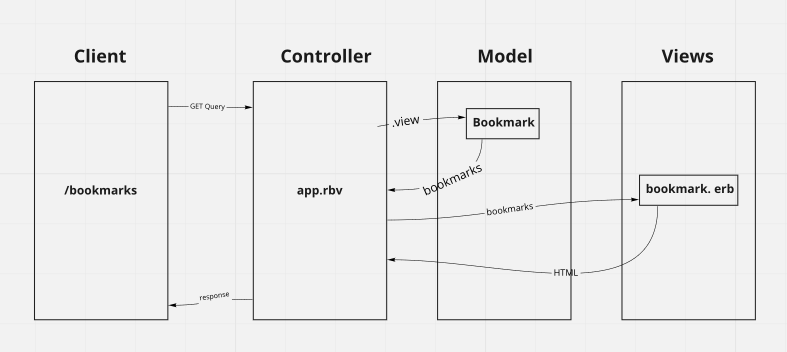

# Bookmark Challenge - Week 4

## Show a list of bookmarks
As a browser user  
So I can find websites quicker  
I want to see a list of bookmarks  

## Database setup instructions
Connect to psql  
Create the database using the psql command CREATE DATABASE bookmark_manager;  
Connect to the database using the pqsl command \c bookmark_manager;  
Run the query we have saved in the file 01_create_bookmarks_table.sql  